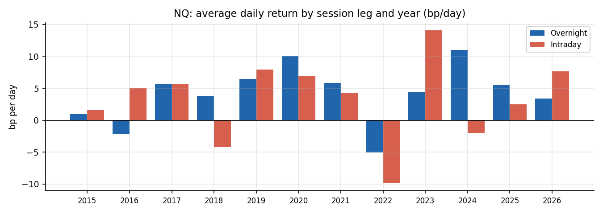
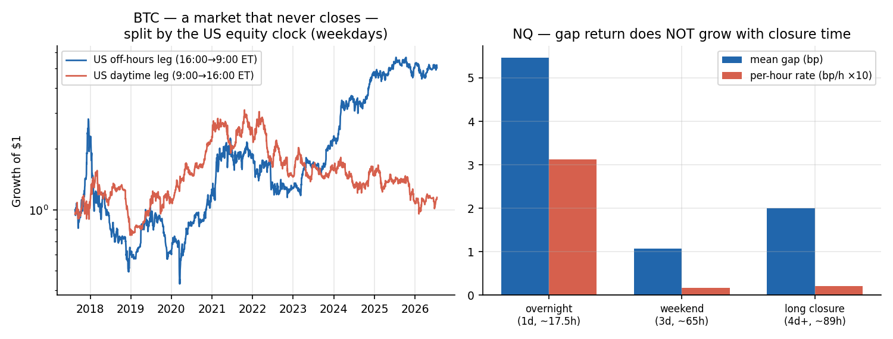

# The Overnight Return Premium in Equity Index Futures (2015–2026)

A replication study of the documented "overnight return premium" (Cliff, Cooper & Gulen 2008; Lou, Polk & Skouras, *Journal of Financial Economics* 2019) on **tradeable futures prices** — NQ and ES, 2,674 trading days of 1-minute data, June 2015 – June 2026.

**Fully reproducible from this repo alone:** the derived daily session-leg data is committed (`data/*_legs.csv`, ~250KB each), so every statistic and figure reruns with nothing but `git clone` and `python src/overnight_intraday_study.py`.

## The question

Split each trading day at the cash-market open and close. The classic literature finds that in US equity indices, nearly all long-run returns historically accrued **overnight** (close→open) while **intraday** (open→close) averaged near zero. This partition is defined by the clock — no thresholds, no windows, nothing to overfit — making it an ideal subject for honest replication.

Futures sharpen the test in two ways. Both legs are computed from actually tradeable prices (equity studies rely on untradeable close-to-open gaps). And because futures trade ~23h/day, traders *can* react to news overnight — so a premium that persists in futures argues against simple "locked-in risk" explanations and favors the clientele-based mechanism of Lou, Polk & Skouras.

## Pre-registered design

Fixed before computing any results, no parameters swept: overnight = 16:00→9:30 ET, intraday = 9:30→16:00; fills at the first 1-minute close at/after each boundary (30-min tolerance drops holidays); costs for tradability = one round-trip/day (all-in commission + 1 tick slippage per side); circular block bootstrap (21-day blocks, 10k reps); one a-priori subperiod split at 2020-12-31.

## Results


| | NQ overnight | NQ intraday | ES overnight | ES intraday |
| --- | --- | --- | --- | --- |
| Mean bp/day | +4.34 | +3.18 | +2.98 | +2.21 |
| Annualized | +11.6% | +8.3% | +7.8% | +5.7% |
| 90% bootstrap CI (bp) | [+1.9, +6.8] | [+0.2, +6.1] | [+0.7, +5.2] | [−0.1, +4.4] |
| P(mean ≤ 0) | 0.3% | 3.9% | 2.1% | 5.6% |
| Volatility (ann.) | 13.8% | 17.0% | 11.7% | 13.1% |
| Monthly Sharpe | 0.87 | 0.52 | 0.65 | 0.46 |
| Growth of $1 (11y) | $2.89 | $2.00 | $2.06 | $1.65 |

**The direction replicates; the strong form does not.** Overnight beat intraday on both instruments while carrying *less* volatility — the Sharpe gap (0.87 vs 0.52 on NQ) is much wider than the return gap, and compounding turns a "small" ~3%/yr gap into $2.89 vs $2.00 per dollar over 11 years. But the classic strong-form claim — intraday ≈ zero — does not hold in this modern sample: intraday was solidly positive on NQ, consistent with published anomalies attenuating after publication.



**Stability.** The overnight premium is stable across the pre-registered halves (+4.40 bp/day pre-2021, +4.28 after on NQ) and weathered the 2022 bear market better than the intraday leg (−5.0 vs −9.8 bp/day).

## Tradability

| Overnight-only, net of daily costs | NQ | ES |
| --- | --- | --- |
| Avg cost per day | 0.81 bp | 1.78 bp |
| Net return | **+9.3%/yr** | +3.1%/yr |
| P(≤ 0) | 1.1% | **19.7%** |
| Monthly Sharpe | 0.71 | 0.26 |

Three honest conclusions: the NQ overnight-only strategy is statistically real after costs; it nonetheless does **not** beat buy-and-hold (+20.9%/yr, 0.96 Sharpe, no daily costs) in this sample — it is a risk-reduction tilt, not an outperformance strategy; and on ES the premium does not survive costs at all.

## Discussion

The result lands between the literature's strong claim and a null: a real, stable overnight premium exists in modern NQ futures, but smaller than the 1993–2008 equity era suggested, and not by itself a reason to trade rather than hold. Its persistence in a venue where overnight trading is fully possible weighs against pure inaccessibility-risk explanations. A calibration note: a ~3%/yr gap sounds small — but it survives bootstrap inference, costs, and a pre-registered subperiod split, which is more than most backtested "edges" can say. Real systematic effects are small; that is why costs and statistical honesty, not indicator creativity, decide what is tradeable.

**Limitations:** unadjusted continuous contracts (quarterly roll gaps land in the overnight leg, small relative to leg volatility); a single asset class in a predominantly bull-market sample; no financing/margin modeling; boundary fills assume marketable orders at the first 1-minute close.

## Extensions (exploratory): the premium follows the clock, not the closure

A follow-up hypothesis — "optimism accumulated while markets are closed inflates the open" — was formalized into falsifiable predictions and tested (`src/extensions_study.py`). Unlike the main study these tests were exploratory, not pre-registered, and should be weighted accordingly. Every prediction failed, and the failures point somewhere more interesting:

- **Gap returns do not grow with closure time.** The premium sits in ordinary weekday overnights (~17.5h closed, +5.5 bp); weekends (~65h) and long holiday closures carry approximately nothing. Per hour closed: 0.31 bp vs 0.02 bp.
- **No post-closure reversal.** If opens were optimism-inflated, Mondays should deflate; instead Monday has the *strongest* intraday returns of the week.
- **Gap variance grows far slower than closed time** — volatility accrues in trading time, independently rediscovering French & Roll (1986).
- **Venue comparison (same period):** cash ETFs route 60–62% of returns through the overnight leg, futures 57–58% — the direction a market-structure story predicts, but small.
- **The crypto control is the decisive test:** BTC and ETH never close, yet split by the US equity clock they show the *same* pattern, stronger — 77%+ of BTC's weekday return accrues during US off-hours, and ETH's US-daytime leg is negative. Crypto also earns its normal off-hours rate straight through weekends, while equity futures — which also trade much of the weekend — earn nothing.



Taken together: closure-based explanations (queued optimism, locked-in risk compensation) are ruled out. The overnight premium is a property of the weekday clock — **volatility lives inside the US trading day; returns accrue outside it** — in whatever venue happens to be trading, which is a wrinkle for any explanation that leans on equity-market structure alone. Derived legs data for all six instruments (SPY, QQQ, ES, NQ, BTC, ETH) is committed in `data/`, so these tables reproduce from a clone. Caveats: crypto sample is 2017–2026 with large drift and volatility; crypto boundaries are 9:00 ET (hourly bars) — an NQ 9:00-boundary check shows the half-hour shift is immaterial; ETF prices are adjusted series (dividend effects ~1%/yr may smear across legs).

## Reproducing

```bash
pip install pandas numpy
python src/overnight_intraday_study.py        # both symbols, full tables
python src/overnight_intraday_study.py NQ     # one symbol
```

To rebuild `data/*_legs.csv` from raw 1-minute bars, set `RAW_DATA_DIR` to a folder of `MNQ_YYYY/raw_data.csv` / `ES_YYYY/raw_data.csv` files (Databento GLBX.MDP3, ohlcv-1m).

---

*Companion project: an 11-year falsification study of ICT/"Smart Money" trading strategies, built with the same validation machinery (nested walk-forward, cost modeling, bootstrap inference). See my other repositories.*

*Not financial advice. Research and educational purposes.*
